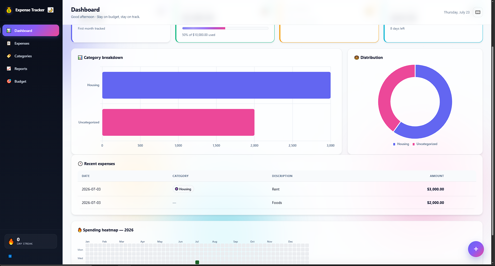
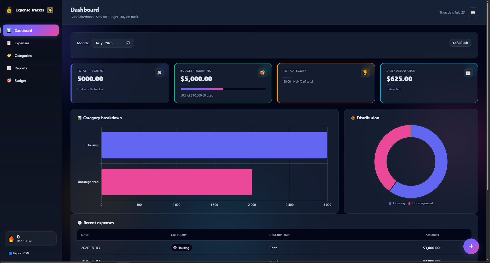
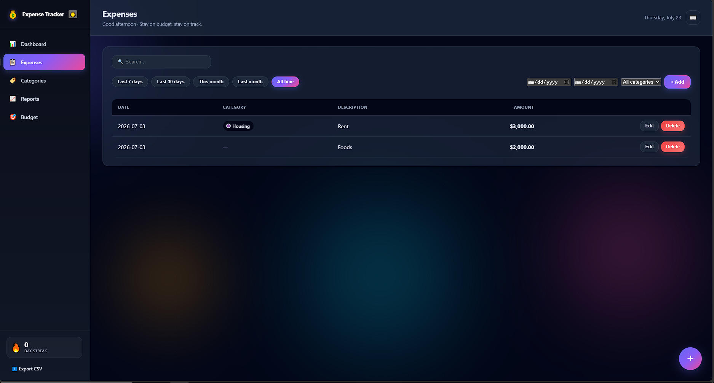
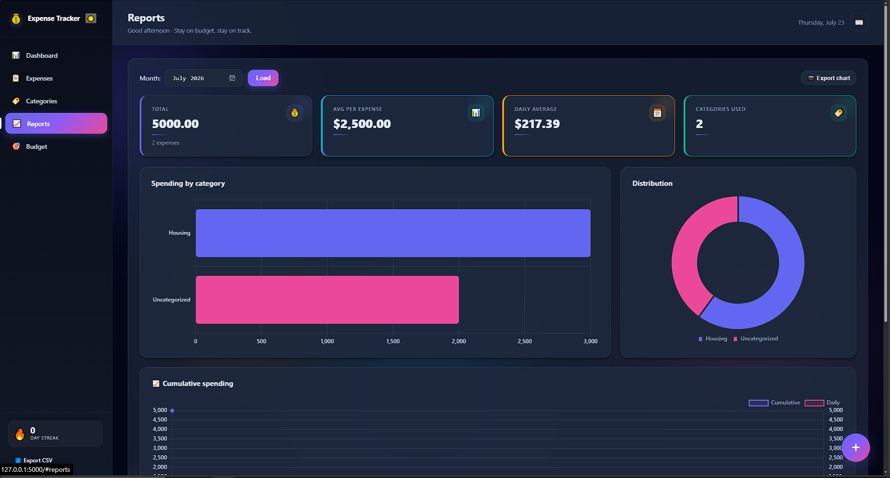
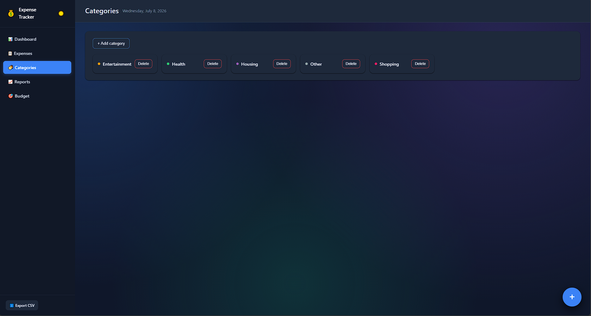
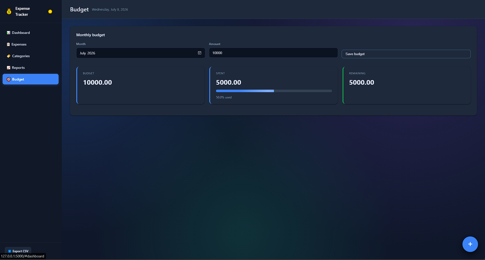
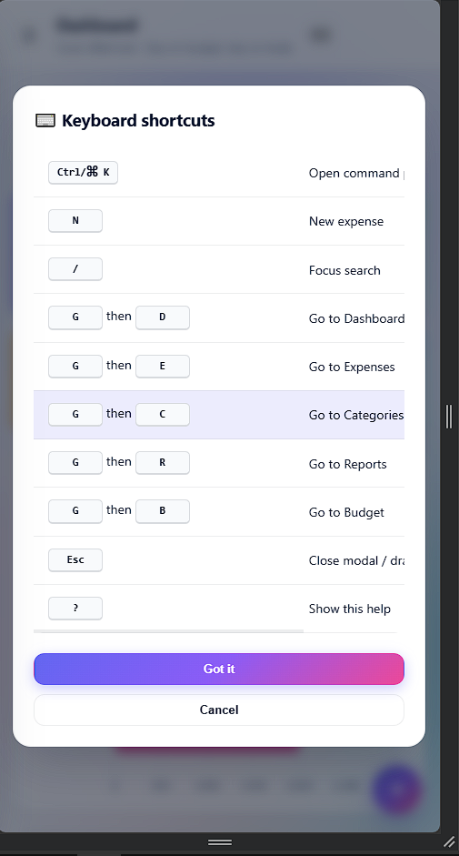
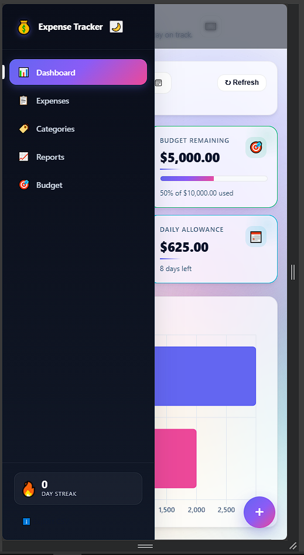

<div align="center">

# 💸 Expense Tracker

### A modern, feature-rich Python expense tracker with a CLI, interactive REPL, Flask web dashboard, SQLite storage, recurring expenses, budgets, multiple wallets, multi-currency support, financial intelligence, currency conversion, reporting, and JSON import/export.

Built to be simple enough for the terminal while providing a full web interface for day-to-day expense management.

Track your spending from the **terminal** or through a **beautiful responsive web dashboard**.

> 🚀 **Current release line: v0.5.0 — Financial Intelligence**. The project extends the v0.4.x feature set with analytics, trends, comparisons, and dashboard intelligence while preserving the existing CLI, web, wallet, currency, budget, recurring-expense, and import/export workflows.


</div>

---

# 📑 Table of Contents
* [**📊 Project Overview**](#-project-overview)
* [**📸 Preview**](#-preview)
* [**✨ Features**](#-features)
* [**🛠️ Tech Stack**](#️-tech-stack)
* [**📁 Project Structure**](#-project-structure)
* [**🚀 Installation**](#-installation)
  * [Prerequisites](#prerequisites)
  * [Windows — PowerShell](#windows--powershell)
  * [macOS / Linux](#macos--linux)
  * [Verify the Installation](#verify-the-installation)
  * [First Run & Database](#first-run--database)
  * [Optional Development Setup](#optional-development-setup)
  * [Upgrading](#upgrading)
  * [Deactivating the Virtual Environment](#deactivating-the-virtual-environment)
* [**📖 CLI Usage**](#-cli-usage)
* [**🌐 Web Interface**](#-web-interface)
* [**🏛️ Architecture**](#️-architecture)
* [**💾 Database Schema**](#-database-schema)
* [**🧪 Running Tests**](#-running-tests)
* [**🩹 Troubleshooting**](#-troubleshooting)
* [**🛠️ Development**](#️-development)
* [**🗺️ Roadmap**](#️-roadmap)
* [**🤝 Contributing**](#-contributing)
* [**📄 License**](#-license)
* [**🙋 FAQ**](#faq)
* [**⭐ Show Your Support**](#-show-your-support)

---

# 📊 Project Overview

| | |
|---|---|
| 🐍 Language | Python 3.10+ |
| 🌐 Web Framework | Flask 3.x |
| 💾 Database | SQLite |
| 🖥 Interface | CLI + Interactive REPL + Web |
| 📱 Responsive | ✅ |
| 🧪 Tested | Pytest |
| 📄 License | MIT |

---

# 📸 Preview

<p align="center">
  
  
  
  
  
  
  
  
</p>

## CLI — Monthly summary

```
─────────────────────── Summary — 2026-06 ───────────────────────
 Total: 2687.49 across 5 expenses
 Budget: 3000.00  Remaining: 312.51

                           By Category
 ┌────────────────┬───────┬─────────┬──────┐
 │ Category       │ Count │  Total  │   %  │
 ├────────────────┼───────┼─────────┼──────┤
 │ Housing        │     1 │ 2500.00 │ 93.0 │
 │ Food           │     2 │  132.50 │  4.9 │
 │ Transport      │     1 │   45.00 │  1.7 │
 │ Entertainment  │     1 │    9.99 │  0.4 │
 └────────────────┴───────┴─────────┴──────┘
```

## Web — Dashboard, reports & per-category budgets

```
┌──────────────────┬────────────────────────┬─────────────────┐
│ Total — 2026-06  │ Budget remaining       │ Top category    │
│     2,687.49     │         312.51         │ Housing         │
│  5 expenses      │ ▓▓▓▓▓▓▓▓▓▓░░░░ 89%    │    2,500.00     │
└──────────────────┴────────────────────────┴─────────────────┘

Per-category budgets
┌────────────┬─────────┬─────────┬──────────┬────────────────────┐
│ Category   │ Budget  │ Spent   │ Remaining│ Usage              │
├────────────┼─────────┼─────────┼──────────┼────────────────────┤
│ 🍔 Food    │  300.00 │  132.50 │  167.50  │ ▓▓▓▓▓░░░░░  44%   │
│ 🚗 Transp. │  150.00 │   45.00 │  105.00  │ ▓▓▓░░░░░░░  30%   │
│ 🎬 Entert. │   50.00 │    9.99 │   40.01  │ ▓▓░░░░░░░░  20%   │
└────────────┴─────────┴─────────┴──────────┴────────────────────┘
```

---

# ✨ Features

## Core
- ➕ **Add / Edit / Delete** expenses with description, amount, date, and category
- 🏷️ **Manage categories** — create custom ones with your own colors
- 🔍 **Filter & search** by date range and category
- 💵 **Set monthly budgets** — overall *or* per-category
- 📊 **Monthly summary** with totals, counts, percentages, and budget tracking
- 🧠 **Financial intelligence** with 12-month trends, month-over-month changes, daily averages, active days, top categories, and top expenses
- 📤 **Export to CSV** for spreadsheet analysis or backup
- 🗄️ **Local SQLite** — no servers, no cloud, your data stays on your machine

## CLI
- 🎨 **Beautiful terminal UI** powered by Rich
- 📈 **Visualize** spending as a horizontal bar chart (PNG via matplotlib)
- 🧪 **Fully tested** with pytest (6 tests, all passing)

## 🌐 Web Interface
- 🖥️ **Single-page application** — Dashboard, Expenses, Categories, Reports, Budget
- 📊 **Interactive charts** powered by Chart.js (bar + doughnut)
- 🎯 **Per-category budget management** with progress bars
- 📈 **Modal forms** with validation and toast notifications
- 📱 **Responsive layout** — works on phone, tablet, desktop
- 🔄 **Same SQLite database** — CLI and web share data seamlessly

## 💸 Expense Management
- Add, edit, delete, and list expenses
- Expense descriptions and amounts
- Date-based expense tracking
- Category support
- Search and filtering
- Monthly expense summaries
- CSV export
- Wallet assignment
- Per-expense currency support

## 👛 Multiple Wallets
Manage expenses across multiple wallets/accounts.
- Create multiple wallets
- Assign a currency to each wallet
- Assign expenses to specific wallets
- Update wallet names and currencies
- Delete wallets
- View wallet-specific information
- Default Main Wallet for existing installations

## 💱 Multi-Currency Support
Track expenses and wallets using different currencies.
- Multiple currency codes per wallet and expense
- Cached exchange rates
- Manual exchange-rate entry
- Live rate resolution when a pair is missing
- Currency conversion
- Inverse-rate fallback
- Currency rate API endpoints
- Currency-aware CSV exports

## 🧠 Financial Intelligence — v0.5.0

The v0.5.0 Financial Intelligence layer builds on the existing reporting system and adds a dedicated analytics view without removing or changing the existing summary workflow.

### Included analytics

- 📈 **12-month monthly trend** — view spending across the previous year
- ↔️ **Month-over-month comparison** — compare the selected month with the previous month
- 📊 **Absolute change** — see how much spending increased or decreased
- 📐 **Percentage change** — understand the relative month-over-month movement
- 📅 **Daily average** — average spending across the selected month
- 🗓️ **Active spending days** — identify how many days contained transactions
- 🏷️ **Top categories** — identify the largest spending categories
- 💳 **Top expenses** — identify the largest individual transactions
- 👛 **Wallet-aware analysis** — restrict analytics to a selected wallet
- 💱 **Currency-aware analysis** — calculate analytics in a requested reporting currency
- 🌐 **REST API** — consume intelligence data programmatically
- 📊 **Dashboard metrics** — surface the most useful indicators directly on the web dashboard

### API example

```text
GET /api/reports/intelligence?month=2026-06&currency=USD
```

Optional wallet filtering can be supplied with `wallet_id`.

The endpoint is intentionally additive: the existing monthly summary API remains available and continues to provide the original report structure.

### Example response shape

```json
{
  "month": "2026-06",
  "currency": "USD",
  "total": 2687.49,
  "previous_total": 2510.20,
  "change": 177.29,
  "change_pct": 7.06,
  "transaction_count": 5,
  "active_days": 4,
  "daily_average": 89.58,
  "top_categories": [],
  "top_expenses": [],
  "monthly_trend": []
}
```

> 💡 The exact category, expense, and trend arrays depend on the data stored in the local database.

## 🐚 Interactive REPL
Use the application through an interactive shell instead of launching a new command for every action.

```bash
py -m expense_tracker.cli shell
```

Example:

```text
Expense Tracker Shell

expense> list
expense> add
expense> summary
expense> wallets list
expense> currency show
expense> exit
```

## 📦 JSON Import / Export
Create portable backups and restore tracker data using JSON.

```bash
py -m expense_tracker.cli export-json -o backup.json
py -m expense_tracker.cli import-json backup.json
```

JSON is useful for backups, migrations, testing, and moving data between installations.

---

# 🛠️ Tech Stack

| Layer            | Tool                                                  |
|------------------|-------------------------------------------------------|
| Language         | Python 3.10+ (tested on 3.14)                         |
| CLI framework    | [Click](https://click.palletsprojects.com/) 8.x       |
| Terminal UI      | [Rich](https://rich.readthedocs.io/) 13.x             |
| Web framework    | [Flask](https://flask.palletsprojects.com/) 3.x 🆕    |
| Frontend         | Vanilla JS + [Chart.js](https://www.chartjs.org/) 4.x 🆕 |
| Design system    | Custom CSS (light/dark tokens, fluid grid, no framework) |
| Database         | SQLite (Python stdlib)                                |
| Charts (CLI)     | [Matplotlib](https://matplotlib.org/) 3.x             |
| Testing          | [pytest](https://docs.pytest.org/) 7.x                |
| Packaging        | `pyproject.toml` (PEP 621, modern standard)           |

> 💡 **Zero runtime dependencies** outside the standard library except for Click, Rich, Matplotlib, and Flask — all installable with one command.

---

# 📁 Project Structure

```
expense-tracker/
│
├── pyproject.toml            # Project metadata & dependencies (PEP 621)
├── requirements.txt          # Pip-installable dependencies
├── README.md                 # You are here
├── CHANGELOG.md              # Release history
├── .gitignore                # Ignore __pycache__, *.db, etc.
│
├── src/
│   └── expense_tracker/
│       ├── __init__.py       # Package marker & version
│       ├── __main__.py       # Enables: python -m expense_tracker
│       ├── cli.py            # All Click commands
│       ├── database.py       # SQLite setup, schema, connection
│       ├── models.py         # Dataclasses + repository classes
│       ├── reports.py        # Monthly aggregation logic
│       ├── visualization.py  # Matplotlib charts
│       ├── web.py            # 🆕 Flask app + JSON REST API
│       │
│       ├── templates/        # 🆕
│       │   └── index.html    #    Single-page app shell
│       │
│       └── static/           # 🆕
│           ├── css/style.css #    Design system
│           └── js/app.js     #    SPA logic (routing, CRUD, charts)
│
└── tests/
    ├── conftest.py           # Shared pytest fixtures (in-memory DB)
    ├── test_models.py        # Repository unit tests
    └── test_reports.py       # Report generation tests
```

The `src/` layout is the modern Python best practice — it prevents accidental imports from the working directory and forces proper packaging.

---

# 🚀 Installation

Expense Tracker is designed to run locally with a standard Python installation. You do **not** need MySQL, PostgreSQL, Node.js, Docker, or a cloud account for the normal setup.

The recommended setup uses a Python virtual environment so the project's dependencies stay isolated from the rest of your system.

## Prerequisites

Before installing, make sure you have:

- **Python 3.10 or newer**
- **pip** — normally bundled with Python
- **Git** — required when cloning the repository
- A terminal:
  - **PowerShell / Windows Terminal** on Windows
  - **Terminal** on macOS / Linux
- A modern browser if you plan to use the Flask dashboard

Check your installed versions before continuing:

### Windows

```powershell
py --version
py -m pip --version
git --version
```

### macOS / Linux

```bash
python3 --version
python3 -m pip --version
git --version
```

> 💡 **Python version:** Python 3.10+ is the supported baseline. The project has also been tested with newer Python versions, including Python 3.14.

---

## Windows — PowerShell

### 1. Clone the repository

Open PowerShell and choose the directory where you keep your projects:

```powershell
cd E:\GITHUB\BUILD
git clone https://github.com/ItsWanheda/expense-tracker.git
cd expense-tracker
```

If the repository is already cloned:

```powershell
cd E:\GITHUB\BUILD\expense-tracker
```

### 2. Create a virtual environment

Create an isolated environment named `.venv`:

```powershell
py -m venv .venv
```

This creates a local Python environment inside the project directory. You only need to create it **once** unless you intentionally remove it.

### 3. Activate the virtual environment

```powershell
.\.venv\Scripts\Activate.ps1
```

After activation, your prompt should look similar to:

```text
(.venv) PS E:\GITHUB\BUILD\expense-tracker>
```

If PowerShell reports that script execution is disabled, run this once for your user account:

```powershell
Set-ExecutionPolicy -ExecutionPolicy RemoteSigned -Scope CurrentUser
```

Then activate again:

```powershell
.\.venv\Scripts\Activate.ps1
```

### 4. Confirm the environment is active

```powershell
python --version
python -m pip --version
```

Using `python -m pip` after activation makes it clear that pip belongs to the active virtual environment.

### 5. Upgrade packaging tools

```powershell
python -m pip install --upgrade pip setuptools wheel
```

Keeping pip and the build tools current can prevent installation problems when Python packages need to build wheels.

### 6. Install Expense Tracker

For normal runtime use:

```powershell
python -m pip install -e .
```

The `-e` flag installs the local project in **editable mode**, so source-code changes are immediately available without reinstalling the package.

For development and testing:

```powershell
python -m pip install -e ".[dev]"
```

The development extra adds the project's test tooling.

### 7. Alternative: install from requirements.txt

If you prefer installing the dependency list directly:

```powershell
python -m pip install -r requirements.txt
```

This is useful for environments where you do not want to install the package itself in editable mode.

### 8. Verify the installation

```powershell
python -m expense_tracker --help
python -m expense_tracker --version
```

You can also verify the installed command entry point:

```powershell
expense --help
```

The expected package version on the v0.5.0 development line is:

```text
0.5.0
```

### 9. Initialize the application

The database is initialized automatically when the application needs it. A safe first command is:

```powershell
python -m expense_tracker categories list
```

This initializes the local database and shows the available categories.

### 10. Start the web dashboard

```powershell
python -m expense_tracker.web
```

Then open:

```text
http://127.0.0.1:5000
```

Keep the terminal window running while you use the dashboard. Press **Ctrl+C** to stop the development server.

---

## macOS / Linux

### 1. Clone the repository

```bash
git clone https://github.com/ItsWanheda/expense-tracker.git
cd expense-tracker
```

### 2. Create the virtual environment

```bash
python3 -m venv .venv
```

### 3. Activate it

```bash
source .venv/bin/activate
```

Your shell should now show `.venv` in the prompt.

### 4. Upgrade pip and build tools

```bash
python3 -m pip install --upgrade pip setuptools wheel
```

### 5. Install the project

Normal installation:

```bash
python3 -m pip install -e .
```

Development installation:

```bash
python3 -m pip install -e ".[dev]"
```

Or install the dependency file directly:

```bash
python3 -m pip install -r requirements.txt
```

### 6. Verify

```bash
python3 -m expense_tracker --help
python3 -m expense_tracker --version
expense --help
```

### 7. Initialize the database

```bash
python3 -m expense_tracker categories list
```

### 8. Start the web dashboard

```bash
python3 -m expense_tracker.web
```

Open:

```text
http://127.0.0.1:5000
```

Press **Ctrl+C** in the terminal to stop the development server.

---

## Verify the Installation

After installation, run this small verification sequence.

### Windows

```powershell
# Check Python
py --version

# Check the package
py -m expense_tracker --version

# Check CLI help
py -m expense_tracker --help

# Initialize / inspect the database
py -m expense_tracker categories list

# Run the test suite
py -m pytest -v
```

### macOS / Linux

```bash
python3 --version
python3 -m expense_tracker --version
python3 -m expense_tracker --help
python3 -m expense_tracker categories list
python3 -m pytest -v
```

If all commands complete successfully, the application, database layer, CLI, and test environment are ready.

---

## First Run & Database

Expense Tracker does **not** require a separate database server. It uses SQLite and automatically creates the application database when needed.

### Default database location

| Operating System | Database Path |
|---|---|
| Windows | `C:\Users\<you>\.expense_tracker\expenses.db` |
| macOS / Linux | `~/.expense_tracker/expenses.db` |

The application creates the directory if necessary and initializes the schema.

### Default categories

On first initialization, the application seeds the standard categories:

**Food 🍔 · Transport 🚗 · Housing 🏠 · Entertainment 🎬 · Health 💊 · Shopping 🛍️ · Other 📦**

You can create your own categories later.

### Backing up your data

Your SQLite database contains your real expense records, so back it up before manually modifying or deleting database files.

The recommended application-level backup is JSON:

```powershell
py -m expense_tracker export-json -o backup.json
```

Restore it with:

```powershell
py -m expense_tracker import-json backup.json
```

JSON backups are portable and can be used to move data between installations.

> ⚠️ **Important:** Do not delete `~/.expense_tracker/expenses.db` or the Windows equivalent simply to fix an installation problem. Back up your data first.

---

## Optional Development Setup

If you plan to modify the source code, run tests, or work on new features, install the development dependencies:

```powershell
py -m pip install -e ".[dev]"
```

Then verify the development environment:

```powershell
py -m pytest -v
```

The project uses the `src/` layout, so installing the package in editable mode is the recommended development workflow.

---

## Upgrading

When updating an existing checkout, back up your data first:

```powershell
py -m expense_tracker export-json -o expense-backup.json
```

Then update the repository:

```powershell
git pull
```

Reinstall the editable package so dependency changes are picked up:

```powershell
py -m pip install -e .
```

For development:

```powershell
py -m pip install -e ".[dev]"
```

Finally verify:

```powershell
py -m expense_tracker --version
py -m pytest -v
```

Do **not** remove the existing database as part of a normal upgrade. The application is designed to initialize its schema without destroying existing data.

---

## Deactivating the Virtual Environment

When you finish working:

```powershell
deactivate
```

The same command works on macOS/Linux:

```bash
deactivate
```

You do **not** need to recreate `.venv` the next time you work on the project. Simply activate it again:

```powershell
.\.venv\Scripts\Activate.ps1
```

or:

```bash
source .venv/bin/activate
```

---

## Installing Without a Virtual Environment

A virtual environment is strongly recommended, but it is possible to install the project directly into the current Python environment:

```powershell
py -m pip install -e .
```

This approach is convenient for a disposable machine or isolated Python installation, but it can cause dependency conflicts with other Python projects.

For development machines, prefer `.venv`.

---

## Installation Notes

- **No Node.js build step is required** for the bundled web UI.
- **No external SQLite server is required.**
- **No cloud account is required** for normal operation.
- **Currency-rate resolution can contact a remote rate source** when a requested exchange rate is not already cached locally.
- The Flask `app.run()` server is intended for local development, not direct public exposure.
- If installation fails while downloading/building dependencies, check your Python version, pip version, network connection, and configured package index/mirror.
- If `pip` is not recognized on Windows, use `py -m pip` instead.

---

# 📖 CLI Usage

## Quick start — your first 5 minutes

```bash
# 1. See what categories exist (7 are auto-seeded)
py -m expense_tracker categories list

# 2. Add a few expenses
py -m expense_tracker add -a 12.50 -d "Lunch at cafe" -c Food
py -m expense_tracker add -a 45.00 -d "Uber to airport" -c Transport
py -m expense_tracker add -a 120.00 -d "Weekly groceries" -c Food
py -m expense_tracker add -a 9.99 -d "Netflix" -c Entertainment
py -m expense_tracker add -a 2500.00 -d "Rent" -c Housing

# 3. View your expenses
py -m expense_tracker list

# 4. Set a budget and see your summary
py -m expense_tracker budget 3000
py -m expense_tracker summary

# 5. Generate a chart
py -m expense_tracker chart -o my-spending.png

# 6. Export for spreadsheet
py -m expense_tracker export -o expenses.csv
```

## All CLI commands

| Command | Description |
|---|---|
| `add` | Add a new expense |
| `list` | List expenses (with filters) |
| `edit ID` | Edit an existing expense |
| `delete ID` | Delete an expense by ID |
| `summary [-m MONTH]` | Show monthly summary + budget status |
| `budget AMOUNT [-m MONTH] [-c CATEGORY]` | Set a monthly budget (overall or per-category) 🆕 |
| `chart [-o FILE]` | Generate a PNG bar chart |
| `export [-o FILE]` | Export to CSV |
| `categories list` | List all categories |
| `categories add NAME` | Create a new category |
| `categories delete ID` | Delete a category |

## Adding expenses

```bash
# Minimal — defaults to today's date, no category
py -m expense_tracker add -a 25.00 -d "Book"

# Full
py -m expense_tracker add -a 45.00 -d "Uber" -c Transport --date 2024-05-15

# Create a brand-new category on the fly (it will ask)
py -m expense_tracker add -a 9.99 -d "Netflix" -c Subscriptions
# ? Category 'Subscriptions' doesn't exist. Create it? [y/N]: y
```

## Listing with filters

```bash
# Most recent 20
py -m expense_tracker list

# Filter by date range
py -m expense_tracker list --from 2024-05-01 --to 2024-05-31

# Filter by category
py -m expense_tracker list -c Food

# Combine filters and show more
py -m expense_tracker list -c Food --from 2024-05-01 --to 2024-05-31 -n 50
```

## Editing & deleting

```bash
# Only the fields you pass get updated (others stay the same)
py -m expense_tracker edit 3 -a 130.00 -d "Weekly groceries (updated)"
py -m expense_tracker edit 3 -c Transport        # change category only
py -m expense_tracker edit 3 --date 2024-05-20    # change date only

# Delete by ID
py -m expense_tracker delete 5
```

## Monthly summary

```bash
# Current month
py -m expense_tracker summary

# Specific month
py -m expense_tracker summary -m 2024-05
```

Output:
```
──────────────────── Summary — 2024-05 ────────────────────
Total: 2687.49 across 4 expenses
Budget: 3000.00  Remaining: 312.51

                By Category
┌──────────────┬───────┬─────────┬─────┐
│ Category     │ Count │  Total  │  %  │
├──────────────┼───────┼─────────┼─────┤
│ Housing      │     1 │ 2500.00 │ 93% │
│ Food         │     2 │  132.50 │  5% │
│ Transport    │     1 │   45.00 │  2% │
│ Entertainment│     1 │    9.99 │  0% │
└──────────────┴───────┴─────────┴─────┘
```

If you've exceeded your budget, `Remaining` will turn red automatically.

## Budgets 🆕

```bash
# Overall monthly budget
py -m expense_tracker budget 3000
py -m expense_tracker budget 3000 -m 2024-05

# Per-category budget 🆕
py -m expense_tracker budget 300 -c Food
py -m expense_tracker budget 50  -c Entertainment -m 2024-05
```

You can mix both — an overall budget caps total spending, while per-category budgets cap individual categories. They're evaluated independently.

## Charts

```bash
py -m expense_tracker chart -o may.png            # saves may.png
py -m expense_tracker chart -o may.png -m 2024-05  # specific month
```

## CSV export

```bash
py -m expense_tracker export -o expenses.csv
py -m expense_tracker export -o may.csv --from 2024-05-01 --to 2024-05-31
```

The CSV has columns: `id, date, category, amount, description`.

## Wallets

```bash
# List wallets
py -m expense_tracker wallets list

# Create a wallet
py -m expense_tracker wallets add "Travel" --currency EUR
```

## Multi-Currency

```bash
# Show supported currencies
py -m expense_tracker currency show

# Convert between currencies
py -m expense_tracker currency convert 100 USD EUR

# Set a manual rate
py -m expense_tracker currency rate EUR USD 1.17
```

Exchange rates are cached locally. When a requested pair is not available locally, the application can resolve it live and cache the result.

## Interactive REPL

```bash
py -m expense_tracker shell
```

The REPL lets you run tracker commands interactively without restarting the CLI for every operation.

## JSON Import / Export

```bash
# Export a portable backup
py -m expense_tracker export-json -o backup.json

# Restore from a backup
py -m expense_tracker import-json backup.json
```

---

# 🌐 Web Interface

**Available in the current release.** A complete single-page application that talks to the same SQLite database as the CLI — every entry you add in the browser shows up in the terminal and vice-versa.

## Start the server

```bash
py -m expense_tracker.web
```

Then open **http://127.0.0.1:5000** in your browser.

You can also use the Flask CLI:

```bash
export FLASK_APP=expense_tracker.web     # macOS / Linux
$env:FLASK_APP = "expense_tracker.web"   # Windows PowerShell
flask run --debug
```

## Pages

| Page | What it does |
|---|---|
| 📊 **Dashboard** | Total spent this month, budget remaining with a progress bar, top category, and recent expenses |
| 📋 **Expenses** | Full CRUD with date/category filters, modal forms for add/edit, inline delete confirmation |
| 🏷️ **Categories** | Grid of colored category cards with add/delete and a color picker |
| 📈 **Reports** | Interactive bar + doughnut charts (Chart.js) plus a category breakdown table with Budget & Remaining columns when applicable |
| 🎯 **Budget** | Manage overall **and** per-category budgets in one place, with per-category progress bars and an active-budgets table with Edit/Delete |
| 👛 **Wallets** | Create, edit, delete, and manage multiple wallets |
| 💱 **Currencies** | View rates, enter manual rates, and convert between currencies |
| 🔄 **Recurring** | Manage recurring expenses and generate due entries |

## API

The web UI talks to a small JSON REST API. You can use it directly too:

| Method | Endpoint | Purpose |
|---|---|---|
| `GET` | `/api/health` | Health check |
| `GET` | `/api/categories` | List categories |
| `POST` | `/api/categories` | Create category |
| `DELETE` | `/api/categories/<id>` | Delete category |
| `GET` | `/api/expenses` | List expenses (filters: `from`, `to`, `category_id`, `limit`) |
| `POST` | `/api/expenses` | Create expense |
| `PUT` | `/api/expenses/<id>` | Update expense (partial) |
| `DELETE` | `/api/expenses/<id>` | Delete expense |
| `GET` | `/api/reports/summary?month=YYYY-MM` | Monthly report (incl. `category_budgets`) |
| `GET` | `/api/reports/intelligence?month=YYYY-MM&currency=USD` | Financial intelligence analytics |
| `GET` | `/api/budget?month=…&category_id=…` | Get a single budget |
| `GET` | `/api/budgets?month=YYYY-MM` | List all budgets for a month 🆕 |
| `PUT` | `/api/budget` | Set/update a budget (`category_id` optional) 🆕 |
| `DELETE` | `/api/budget?month=…&category_id=…` | Delete a budget 🆕 |
| `GET` | `/api/export.csv` | Download CSV export |
| `GET` | `/api/wallets` | List wallets |
| `GET` | `/api/wallets/<id>` | Get a wallet |
| `POST` | `/api/wallets` | Create a wallet |
| `PUT` | `/api/wallets/<id>` | Update a wallet |
| `DELETE` | `/api/wallets/<id>` | Delete a wallet |
| `GET` | `/api/currencies` | List supported currencies |
| `GET` | `/api/currencies/rates` | Get cached/resolved currency rates |
| `GET` | `/api/currencies/rate` | Get one currency pair rate |
| `POST` | `/api/currencies/rates` | Save a manual exchange rate |
| `GET` | `/api/currencies/convert` | Convert an amount between currencies |

Example with curl:

```bash
# Add an expense via the API
curl -X POST http://127.0.0.1:5000/api/expenses \
     -H "Content-Type: application/json" \
     -d '{"amount": 12.50, "description": "Lunch", "category_id": 1, "date": "2026-06-30"}'

# Get this month's summary as JSON
curl http://127.0.0.1:5000/api/reports/summary

# Set a per-category budget
curl -X PUT http://127.0.0.1:5000/api/budget \
     -H "Content-Type: application/json" \
     -d '{"month": "2026-06", "amount": 300, "category_id": 1}'

# List wallets
curl http://127.0.0.1:5000/api/wallets

# Get currency rates
curl http://127.0.0.1:5000/api/currencies/rates

# Convert 100 USD to EUR
curl "http://127.0.0.1:5000/api/currencies/convert?base=USD&quote=EUR&amount=100"
```

> 🛡️ For **development only**. Don't expose `app.run()` to the internet — use `gunicorn 'expense_tracker.web:create_app()'` behind a reverse proxy in production.

---

# 🏛️ Architecture

This project follows a **layered architecture** that separates concerns cleanly:

```
┌─────────────────────────────────────────────────────────────┐
│  Presentation Layer                                         │
│  ┌──────────────────────┐    ┌──────────────────────────┐   │
│  │ cli.py (Click+Rich)  │    │ web.py (Flask + JS SPA)  │   │
│  └──────────┬───────────┘    └──────────────┬───────────┘   │
└─────────────┼───────────────────────────────┼───────────────┘
              │                               │
              └───────────────┬───────────────┘
                              │ calls
                              ▼
┌─────────────────────────────────────────────────────────────┐
│  Repository Layer (models.py)                               │
│  - Static methods per entity (CRUD + queries)               │
│  - Returns dataclasses, not raw rows                        │
│  - Shared by both the CLI and the web app                   │
└──────────────────────────┬──────────────────────────────────┘
                           │ uses
                           ▼
┌─────────────────────────────────────────────────────────────┐
│  Data Layer (database.py)                                   │
│  - SQLite connection management (context manager)           │
│  - Schema definition & migrations                           │
└─────────────────────────────────────────────────────────────┘

Cross-cutting:
  reports.py      → aggregation + financial intelligence (CLI + web)
  visualization.py → matplotlib charts (CLI only)
  wallets/currency  → shared wallet and exchange-rate repositories
```

## Why this structure?

| Layer | Responsibility | Why it matters |
|---|---|---|
| **Data** | Manage the connection & schema | One place to change the database |
| **Repository** | Translate Python ↔ SQL | Easy to swap SQLite for Postgres later |
| **Presentation** | Talk to the user (terminal or browser) | Multiple UIs share the same logic |

The **web layer** is just a thin Flask wrapper around the same repositories the CLI uses — zero duplicated SQL, zero duplicated business logic.

## Key design decisions

- **Idempotent `initialize_database()`** — called on every startup (CLI + web); safe to run repeatedly
- **Idempotent `CategoryRepository.create()`** — returns existing ID if name is taken (no surprises)
- **Python-level upserts** for `BudgetRepository` — avoids SQLite's NULL + UNIQUE pitfall
- **Timezone-aware datetimes** — `datetime.now(timezone.utc)`, not deprecated `utcnow()`
- **Context-managed DB connections** — auto-commit on success, auto-rollback on error
- **Single DB, two UIs** — CLI and web read/write the same `~/.expense_tracker/expenses.db`

---

# 💾 Database Schema

```sql
CREATE TABLE categories (
    id         INTEGER PRIMARY KEY AUTOINCREMENT,
    name       TEXT NOT NULL UNIQUE,
    color      TEXT DEFAULT '#3498db',
    created_at TEXT NOT NULL DEFAULT CURRENT_TIMESTAMP
);

CREATE TABLE expenses (
    id          INTEGER PRIMARY KEY AUTOINCREMENT,
    amount      REAL NOT NULL CHECK (amount > 0),
    description TEXT NOT NULL,
    category_id INTEGER,
    date        TEXT NOT NULL,                  -- ISO: YYYY-MM-DD
    created_at  TEXT NOT NULL DEFAULT CURRENT_TIMESTAMP,
    updated_at  TEXT NOT NULL DEFAULT CURRENT_TIMESTAMP,
    FOREIGN KEY (category_id) REFERENCES categories(id) ON DELETE SET NULL
);

CREATE TABLE budgets (
    id          INTEGER PRIMARY KEY AUTOINCREMENT,
    category_id INTEGER,                        -- NULL = overall budget
    month       TEXT NOT NULL,                  -- YYYY-MM
    amount      REAL NOT NULL CHECK (amount >= 0),
    UNIQUE (category_id, month),
    FOREIGN KEY (category_id) REFERENCES categories(id) ON DELETE CASCADE
);
```

## Default categories (auto-seeded on first run)

Food 🍔 · Transport 🚗 · Housing 🏠 · Entertainment 🎬 · Health 💊 · Shopping 🛍️ · Other 📦

## Database location

| OS | Path |
|---|---|
| Windows | `C:\Users\<you>\.expense_tracker\expenses.db` |
| macOS / Linux | `~/.expense_tracker/expenses.db` |

---

# 🧪 Running Tests

```bash
# Run all tests, verbose
py -m pytest -v

# Run with coverage report
py -m pytest --cov=expense_tracker --cov-report=term-missing

# Run a single file
py -m pytest tests/test_models.py -v

# Run a single test
py -m pytest tests/test_models.py::test_update_expense -v
```

## Expected output

```
tests/test_models.py::test_add_and_get_expense PASSED
tests/test_models.py::test_update_expense PASSED
tests/test_models.py::test_delete_expense PASSED
tests/test_models.py::test_list_with_filters PASSED
tests/test_models.py::test_budget_set_and_get PASSED
tests/test_reports.py::test_monthly_report PASSED

========================== 6 passed in 0.4s ==========================
```

## How tests are isolated

The `tmp_db` fixture in `conftest.py`:
1. Creates a **temporary SQLite file** for each test (via `tmp_path`)
2. **Patches** `database.get_db_path` to point at it
3. **Initializes** the schema
4. Cleans up automatically when the test ends

This means tests never touch your real database — completely safe.

---

# 🩹 Troubleshooting

<details>
<summary><b>❌ <code>python</code> is not recognized (Windows)</b></summary>

Reinstall Python from [python.org](https://www.python.org/downloads/) and **check** the box:

> ☑ Add python.exe to PATH

Alternatively, use `py` (the Python Launcher) which is installed automatically on Windows:

```powershell
py --version
```
</details>

<details>
<summary><b>❌ PowerShell blocks script activation</b></summary>

Run **once** as your user:

```powershell
Set-ExecutionPolicy -ExecutionPolicy RemoteSigned -Scope CurrentUser
```

Then try activating again:

```powershell
.\.venv\Scripts\Activate.ps1
```
</details>

<details>
<summary><b>❌ <code>IndentationError</code> after pasting code</b></summary>

Code copied from chat sometimes loses spaces. Verify the syntax with:

```powershell
py -m compileall src\expense_tracker -q
```

If there's an error, open the offending file in your editor and fix the indentation manually.
</details>

<details>
<summary><b>❌ <code>OperationalError: no such table</code></b></summary>

Both the CLI and the web app auto-initialize the database on startup. If you still see this, your `~/.expense_tracker/` directory may be locked or unreadable. Try:

```powershell
# Delete and recreate
Remove-Item -Recurse -Force ~\.expense_tracker
py -m expense_tracker categories list   # this re-creates everything
```
</details>

<details>
<summary><b>❌ <code>UNIQUE constraint failed: categories.name</b></summary>

You tried to create a category that already exists. The CLI handles this automatically by asking, but if you see it in code, use `CategoryRepository.create()` which is idempotent:

```python
# Returns existing ID if "Food" exists, otherwise creates it
cat_id = CategoryRepository.create("Food")
```
</details>

<details>
<summary><b>❌ Web UI won't load (404 on /static/…)</b></summary>

Make sure you launched via the package, not a stray script:

```bash
# ✅ Correct
py -m expense_tracker.web

# ❌ Wrong (Flask can't find templates/static)
cd src && py expense_tracker/web.py
```
</details>

---

# 🛠️ Development

## Adding a new command

1. Open `src/expense_tracker/cli.py`
2. Add a new function decorated with `@cli.command()` (or `@<group>.command()`)
3. Implement it using existing repositories — **don't add SQL here**
4. (Optional) Add a matching API endpoint in `web.py`
5. (Optional) Add a UI section in `static/js/app.js`
6. Add a test in `tests/`

## Adding a new field

1. Add the column to `SCHEMA` in `database.py`
2. Add a migration note to handle existing databases
3. Update the relevant dataclass in `models.py`
4. Update repository methods that touch that field
5. Update `reports.py` / `web.py` / `app.js` if the field is exposed to users
6. Add tests for the new behavior

## Code style

- **PEP 8** for naming and layout
- **Type hints** on all public functions
- **Docstrings** for all public classes and functions
- **Dataclasses** for value objects, not plain dicts
- **No raw SQL in CLI or web code** — always go through a repository

---

# 🏆 Current Release Highlights

The current v0.5.0 development line includes:

- 👛 Multiple wallets
- 💱 Multi-currency expenses and wallets
- 🔄 Cached and live currency-rate resolution
- 💱 Currency conversion
- 🐚 Interactive REPL mode
- 📦 JSON import/export
- 🔁 Recurring expenses
- 📊 Advanced charts
- 🌐 Flask web dashboard and REST API
- 🎯 Overall and per-category budgets

---

# 🗺️ Roadmap

Planned for future releases:
- [x] **Core CRUD for expenses and categories** ✅
- [x] **Monthly summary & overall budget tracking** ✅
- [x] **CSV export** ✅
- [x] **Matplotlib charts (CLI)** ✅
- [x] **Pytest test suite** ✅
- [x] **Per-category budgets** with progress bars ✅ (`0.2.0`)
- [x] **Web interface** using the same repositories ✅ (`0.2.0`)
- [x] **Interactive charts** (Chart.js in the web UI) ✅ (`0.2.0`)
- [x] **Responsive design** — sidebar drawer + stacked layouts + scrollable tables ✅ (`0.3.0`)
- [x] **Light/dark theme** with **live chart recoloring** ✅ (`0.3.0`)
- [x] **Command palette & keyboard shortcuts** ✅ (`0.3.0`)
- [x] **Toast with Undo action** for accidental deletes ✅ (`0.3.0`)
- [x] **Recurring expenses** (rent, subscriptions) ✅ (`0.4.0`)
- [x] **Advanced Charts** ✅ (`0.4.0`)
- [x] **Multi-currency** support with cached/live conversion rates ✅ (`0.4.0`)
- [x] **Interactive REPL mode** (`expense shell`) ✅ (`0.4.0`)
- [x] **JSON import / export** ✅ (`0.4.0`)
- [x] **Multiple Wallets** with wallet-level currencies and expense assignment ✅ (`0.4.0`)
- [x] **Financial Intelligence** with trends, comparisons, daily metrics, and top-spending analysis 🧠 (`0.5.0`)
- [ ] **Telegram / Discord bot** integration
- [ ] **GitHub Actions CI** (run tests on every push)
- [ ] **Publish to PyPI** (`pip install expense-tracker`)
- [ ] **Tag system** (many-to-many)
- [ ] **Pre-commit hooks** (black, ruff, mypy)
- [ ] **User Authentication**
- [ ] **Cloud Sync**
- [ ] **Notifications**
- [ ] **AI Spending Insights**
- [ ] **Progressive Web App (PWA)**
- [ ] **Docker Support**
- [ ] **PDF Report Export**
- [ ] **Advanced Analytics**
- [ ] **Localization & Multi-language**
- [ ] **User Accounts & Profiles**
- [ ] **Excel Export**
- [ ] **PostgreSQL/MySQL Support**

---

# 🤝 Contributing

Contributions of all sizes are welcome! Here's the workflow:

1. **Fork** the repository
2. **Create a branch** for your feature:
   ```bash
   git checkout -b feature/per-category-budgets
   ```
3. **Make your changes** and add tests
4. **Run the test suite** to make sure nothing broke:
   ```bash
   py -m pytest -v
   ```
5. **Commit** with a clear message:
   ```bash
   git commit -m "Add per-category budgets with progress bars"
   ```
6. **Push** and open a Pull Request

Please open an issue first if you want to discuss a big change before implementing it.

---

# 📄 License

This project is licensed under the **MIT License** — see the [LICENSE](LICENSE) file for details. You're free to use, modify, and distribute it, commercially or otherwise.

---

# 🙋 FAQ

**Q: Is my financial data safe?**
A: 100%. Everything is stored in a single SQLite file on your machine. There is no cloud sync, no telemetry, no analytics — nothing leaves your computer.

**Q: Can I sync between machines?**
A: Yes — just copy `~/.expense_tracker/expenses.db` between devices. You could put it in Dropbox/Syncthing/etc. for automatic syncing.

**Q: Can I import data from my bank?**
A: Not yet, but a CSV import command is on the roadmap. In the meantime, you can bulk-insert via a small Python script using the existing repositories.

**Q: Why Click instead of argparse?**
A: Click gives us nested subcommands (`categories add`), automatic `--help` for every level, and better ergonomics with about 60% less code than argparse.

**Q: Can I extend this with a web UI?**
A: You don't have to — there's already one in `0.2.0`! `py -m expense_tracker.web` starts the Flask server. If you want to add your own, the repository pattern makes it trivial: import the repos and return JSON.

**Q: Can the CLI and web app be used at the same time?**
A: Yes. SQLite supports concurrent reads from the same connection pool. Both UIs read/write the same `expenses.db`, so changes in one appear instantly in the other.

**Q: Why no ORMs (SQLAlchemy, Tortoise)?**
A: For a small project, raw SQL with the repository pattern is **simpler**, **faster**, and gives you **full control**. ORMs add abstraction layers that aren't justified at this scale.

**Q: Why Flask and not FastAPI?**
A: Flask's templating + static-file serving made the bundled SPA dead-simple to ship without a separate build step. The REST API uses plain JSON over HTTP, so a future migration to FastAPI is mostly mechanical if performance or async becomes important.

---

# ⭐ Show Your Support

If this project helped you learn something or saved you time, give it a star on GitHub! It helps others discover it.

<div align="center">

**Made with ❤️ and lots of ☕**

[⬆ Back to top](#-expense-tracker)

</div>
